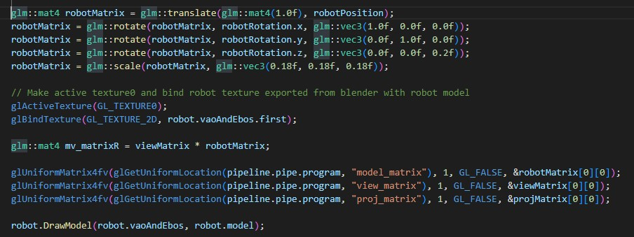

# OpenGL: Interactive Application of my 3D Model

# Models Loaded 
  

I added two separate models.  

First model is the robot (Wall-F, complex), exported from blender with a baked in image texture that was generated using UV Mapping. Present in Assets -> mainrobo.gltf  
Second model is my whole scene without Wall-F robot. Present in Assets -> finalIter2.gltf.  

- I have two Content loaders named content (for scene) and robot (Wall-F).  

  

- Since I wish to animate my robot model, rotate the main scene, I created vec3 variables to store translations, so i can manipulate them later.  

  

- In render method, code snippet below shows the robotMatrix created. I scaled both my models down early on as they were too big and filled up the whole scene. Applied some transformations to get both models to align well.  

  
  

# Scene Built

For building my scene, with trial and error, I changed the translations and rotations along with scale of both my matrices. Since it was two separate objects, I had to align the robot with the plane of the scene.  

# Shaders and Materials

## Materials:  

I created UV Maps of my scene and my robot, baked in all materials, and connected final image texture to my models.
- The textures are added in Assets -> textures.  
- For final textures, I use mainrobo.png for Robot, Untitled.png for scene.  
- Textures need to be made active and binded before drawing. So for both models, before calculating the matrix and drawing, I have binded the respective texture for that model.

## Shaders:

1. Fragment Shaders  
- I have added fragment shaders code only for lighting. Lighting code given in lab was used for fs and vs shaders. I have added all three, Ambient, Diffuse and Specular Lighting along with Shininess constant. Their respective uniforms are added in render method in Source.cpp.  

2. Vertex Shaders
- I have similarly added code for Lighting in vertex shaders. Vec3 variables are turned to Vec4 to allow alpha values.  

# Lights

- For Lighting, I used lab code given, to get started. 

- I changed intensity values and experimented with them to give a canyon, desert like look.  

# Interactions

  

# Keys for Basic Animations Listed for Easy Lookup.

## Robot: 
-   Rotation: J, L
-   Position: W, A, S, D  

## Camera:
-   Position: UP, DOWN, LEFT, RIGHT (for xz plane, front-back and sides)
-   Position: SPACE, LEFT_SHIFT (for y, up and down)

## Scene (!Uses Numpad Keys):
-   Rotation: NUMPAD 4, NUMPAD 6

## Light
-   Position: ADD, SUBTRACT (Numpad) || MINUS, EQUAL  

  

### I have multiple assets in my asset folder, which I was incrementally trying to load combining other models which I didnt wish to animate, while loading the models using I wish to animate using separate content loaders. My Robot seemed to break openGL code everytime I added it in my scene. So I early on I had to focus on getting the Robot model to load along with its textures. I haven't added my tents and the dinosaur skull into openGL as I had imported them from elsewhere, and they were very complex objects with too many faces and multiple complex image materials. To solve my Robot loading issue, I created separate blender file, used decimate modifier and reduced the number of faces of my model, baked materials into a UV mapped image texutre, and then got it to work on openGL.
