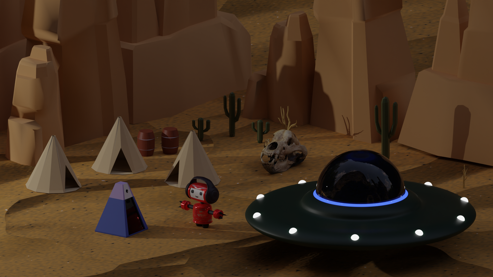
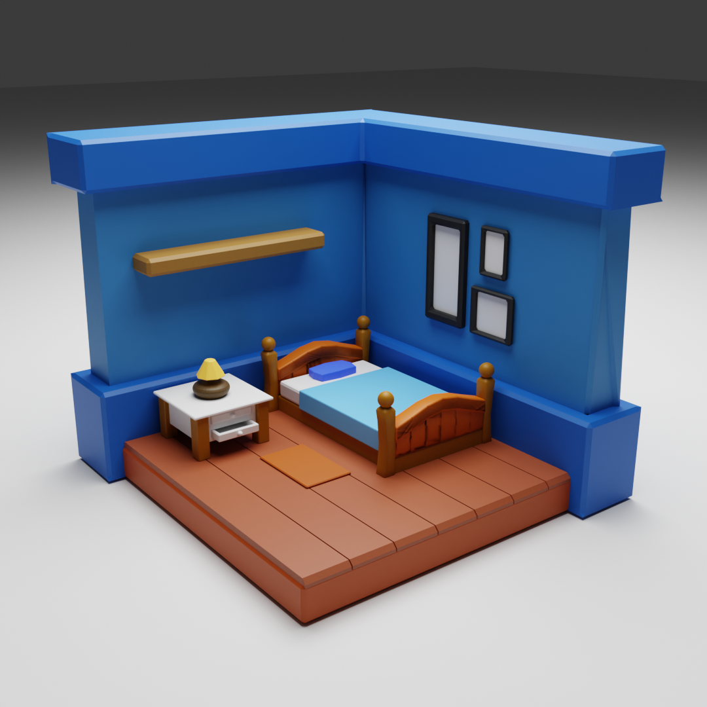
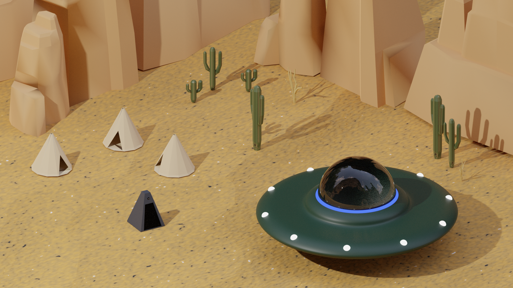

# 3d-animation-cw  

#### Low Poly Desert scene set in the future where humans have long perished and robots from far away visit the remains of a once full of life planet to investigate and explore their origin planet.

The Scene and Robot models are insipired from the fully animated TV Show Love Death + Robots Season 3, Episode 1 : Three Robots: Exit Strategies 

### Reducing File/Folder sizes

- The skeleton model I have imported was around 30mb in size. But I found that blender offers a decimate modifier which reduces the amount of faces/vertices to reduce the size of model.  
- Deleted a large amount of autosaves and crash folder which added upto 10mb of data.  
- Converted final animation video from 1920x1080 avi file of about 1.1gb size to 1280x720 mp4 of size 16mb using mp4 (mpeg4) compression.  

### Scene and Modeling Progress

Living Room scene was the first scene I worked on to learn the basics of blender modeling and adding materials. livingRoom.blend file in appendices is the blend file for the livingroom scene.

 --->  --->  |
 
